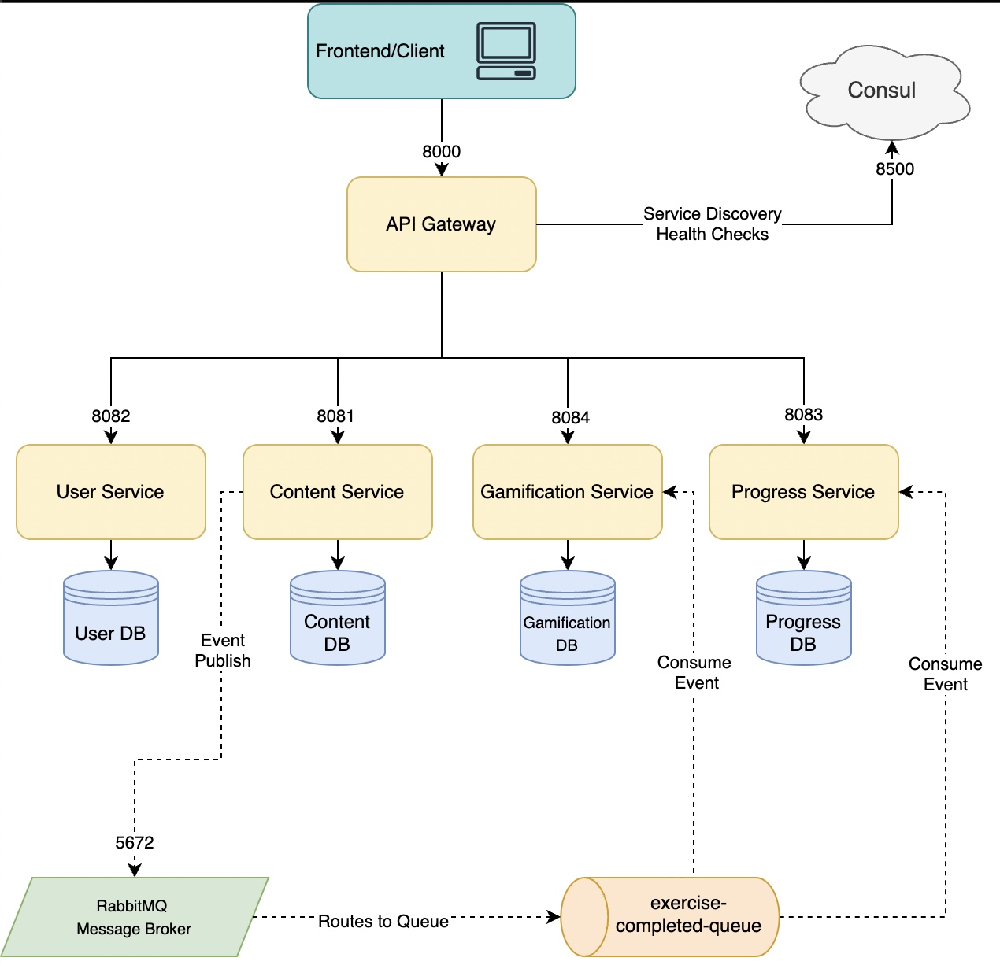

# Digital Math Learning Platform

## Project Overview
This project is a digital learning platform designed to help young students (grades 1-10) improve their math skills through interactive exercises. The platform provides engaging learning experiences for students while supporting teachers and parents in their educational journey. Built using a microservices architecture, the platform ensures scalability and modularity for future enhancements.

---
### User Stories

These are the three priority stories for my project based around the three roles a user can have:

1. **As a student**, I want to practice math through different engaging techniques so that I can improve my skills and stay motivated by tracking my progress.
2. **As a teacher**, I want to create custom exercises based on specific topics and track my students' performance so I can adapt my lessons and provide support where it's needed most.
3. **As a parent**, I want to monitor my child's progress and completed exercises so that I can better support their learning at home.

Due to the student part of the app taking significant development time (such as creating the exercises, getting progress, and trophy data), the functionality for parents and teachers was unfortunately not prioritized as much. They exist and have their own dashboard, but beyond that, their features are limited. Expanding their functionality is a key area I would love to focus on in the future.

---
## Prerequisites

- **Java 17**
- **Maven 3.9.9**
- **Docker version 27.2.0**
- **Docker Compose version 2.29.2**

### Recommended Tools (Optional)
- **IDE**: IntelliJ IDEA for better development experience.
- **Testing Tool**: Postman or an equivalent tool for API testing.
---

## Running the Project

This project is designed to run seamlessly with Docker. Core services, including **Consul**, **RabbitMQ**, and **PostgreSQL**, are all configured to run as Docker containers.

### Quick Start
To run the project, navigate to the `MathLearningPlatform(root)/docker` directory and execute the following command:

```bash 
docker compose up --build
```

This command will build and start all the necessary services and dependencies.

### Troubleshooting
If you encounter any issues during the build or deployment process, follow these steps:

1. **Clean and Rebuild the Services**:
   Run the following Maven command in each service directory to clean and rebuild:
   
    ```bash
    mvn clean install -DskipTests
    ```

   or
   
   ```bash
   mvn clean package -DskipTests
   ```

3. **Rebuild Docker Images**:
   Rebuild the Docker image for the affected service(s) using the following command:

   ```bash
    docker build -t <servicename>:0.0.1-SNAPSHOT .
   ```

4. **Restart Docker Compose**:
   After rebuilding the images, rerun the Docker Compose command:

   ```bash
    docker compose up --build
   ```

### Note
- Ensure that Docker, Docker Compose, and all prerequisites are installed and correctly set up before running the project. If you continue to face issues, verify that your configurations (e.g., ports, environment variables) are correct in the `docker-compose.yml` file.
- **Running Services Locally**: In the worst-case scenario, each service can be run locally using the command `mvn spring-boot:run` in its respective directory. Use this to test individual services, for example, with Postman. Remember to use the port specified in the `application.yml` file of the respective service, not the gateway port.

## To use the application
To test the entire application, open your browser and go to `http://localhost:3000`. You can either sign up for a new account or log in using one of the following test accounts:
  - **Student 1**: `student1@mail.com`  
  - **Student 2**: `student2@mail.com`  
  - **Teacher**: `teacher@mail.com`  
  - **Parent**: `parent@mail.com`  
  - **Password for all accounts**: `password123`

### API Endpoints Overview

This document contains details of all backend API endpoints, categorized by controller. Click on each category to view its associated endpoints.

---

### User Controller
<details>
<summary>Endpoints</summary>

| Method | Endpoint                                              | Description                                      |
|--------|-------------------------------------------------------|--------------------------------------------------|
| GET    | `/api/v1/users/username/{username}`                  | Retrieves a user by their username.             |
| GET    | `/api/v1/users/{id}`                                 | Retrieves a user by their unique ID.            |
| POST   | `/api/v1/users/register`                             | Registers a new user using the provided details.|
| DELETE | `/api/v1/users/{id}`                                 | Deletes a user with the specified ID.           |
| POST   | `/api/v1/users/authenticate`                         | Authenticates a user and generates a JWT token. |

</details>

---

### Math Problem Controller
<details>
<summary>Endpoints</summary>

| Method | Endpoint                                              | Description                                                  |
|--------|-------------------------------------------------------|--------------------------------------------------------------|
| GET    | `/api/v1/content/mathproblem/generate-problem/{topic}`| Generates a math problem for a specific math topic.          |
| GET    | `/api/v1/content/mathproblem/random-persistent/{topic}`| Fetches a random persistent math problem for the given topic.|
| POST   | `/api/v1/content/mathproblem/get-problems`            | Fetches a list of math problems for a given topic.           |

</details>

---

### Game Mode Controller
<details>
<summary>Endpoints</summary>

| Method | Endpoint                                              | Description                                                  |
|--------|-------------------------------------------------------|--------------------------------------------------------------|
| GET    | `/api/v1/content/gamemode/all`                       | Fetches all available game modes.                           |
| POST   | `/api/v1/content/gamemode/initialize`                | Initializes a game mode by topic and number of problems.    |
| GET    | `/api/v1/content/gamemode/{id}`                      | Retrieves a specific game mode by its ID.                   |
| GET    | `/api/v1/content/gamemode/by-topic/{topic}`          | Fetches game modes filtered by a specific math topic.       |
| POST   | `/api/v1/content/gamemode/complete`                  | Marks an exercise as completed in a game mode.             |

</details>

---

### Exercise Result Controller
<details>
<summary>Endpoints</summary>

| Method | Endpoint                                              | Description                                                  |
|--------|-------------------------------------------------------|--------------------------------------------------------------|
| POST   | `/api/v1/progress/exercise-results`                  | Saves an exercise result from an `ExerciseCompletedEvent`.   |
| POST   | `/api/v1/progress/exercise-results/manual`           | Saves an already constructed `ExerciseResult` manually.      |
| GET    | `/api/v1/progress/exercise-results/{studentId}`      | Retrieves all exercise results for a specific student.       |
| GET    | `/api/v1/progress/exercise-results/{studentId}/overall-score` | Calculates a student's overall score.             |

</details>

---

### Student Progress Controller
<details>
<summary>Endpoints</summary>

| Method | Endpoint                                              | Description                                                  |
|--------|-------------------------------------------------------|--------------------------------------------------------------|
| GET    | `/api/v1/progress/student/{studentId}`               | Retrieves progress for a specific student by ID.            |
| PUT    | `/api/v1/progress/student/{studentId}/stats`         | Updates general statistics for a student.                   |
| PUT    | `/api/v1/progress/student/{studentId}/gamemode`      | Updates game mode statistics for a student.                 |
| PUT    | `/api/v1/progress/student/{studentId}/topic`         | Updates topic-specific statistics for a student.            |

</details>

---

### Student Trophy Controller
<details>
<summary>Endpoints</summary>

| Method | Endpoint                                              | Description                                                  |
|--------|-------------------------------------------------------|--------------------------------------------------------------|
| GET    | `/api/v1/gamification/trophies/{studentId}`          | Retrieves all trophies for a specific student by ID.         |
| GET    | `/api/v1/gamification/trophies/{studentId}/specific` | Retrieves a specific trophy based on topic and game mode.    |
| POST   | `/api/v1/gamification/trophies/{studentId}`          | Adds or updates a trophy for a student.                     |
| DELETE | `/api/v1/gamification/trophies/{trophyId}`           | Deletes a trophy by its ID.                                  |

</details>


## Features

### User Roles and Access
- **Students**:
  - Practice math exercises.
  - View progress and achievements.
  - Navigate a fully authenticated system with restricted routes for users.
- **Teachers**:
  - Access a basic dashboard (student performance tracking not yet implemented).
- **Parents**:
  - Access a basic dashboard (child monitoring functionality not yet implemented).
- **Authentication**:
  - Fully implemented signup, login, and logout system.
  - JWT-based access control ensures secure route access.

### Learning Path
- Math modules are grouped into three levels:
  - **Grades 1-4**
  - **Grades 5-7**
  - **Grades 8-10**
- Topics covered:
  - Addition
  - Subtraction
  - Multiplication
  - Division

### Game Modes
- **Classic Mode**:
  - Solve problems quickly to earn points based on speed and accuracy.
- **Multiple Choice Mode**:
  - Select the correct answer from four options (no time-based scoring).

### Gamification and Achievements
- Trophies awarded based on performance:
  - **Bronze**: Score over 50%.
  - **Silver**: Score over 70%.
  - **Gold**: Score over 85%.
- **Achievements Page**:
  - Displays earned trophies for motivation and tracking.

### Statistics and Progress Tracking
- **Stats Page**:
  - View past exercise results.
  - Analyze overall performance statistics.

### Profile Management
- **Profile Page**:
  - Displays user account information.

### Navigation and Usability
- Intuitive navigation ensures a smooth user experience.
- Seamlessly structured routes for authenticated users.

---

## Technical Implementation

### Architecture
- **Backend**: Built using a microservices architecture with Spring Boot.
- **Frontend**: Developed with React + Vite, styled with Tailwind CSS.
- **API Interaction**: Managed with Axios, configured in `src/api.js`.

### Security
- JWT-based authentication restricts access to authorized users.
- Login and signup pages are accessible to non-authenticated users only.

### Scalability
- Modular architecture supports:
  - Future addition of advanced features like progress tracking.
  - New gamification elements and dashboards for teachers/parents.

---

## Current Limitations
- **Leaderboard**: Not implemented yet.
- **Teacher and Parent Features**:
  - Limited to basic dashboards.
  - No ability to track student progress.
- **Content Scope**:
  - Focused on basic math topics (addition, subtraction, multiplication, division).
  - Limited to two game modes (Classic and Multiple Choice).

---

## Future Enhancements
- Expand math topics to include advanced content.
- Introduce a leaderboard for enhanced competition.
- Develop advanced dashboards for teachers and parents to track performance.
- Add new game modes and enhance existing ones for varied learning experiences.


### Service Responsibilities

This section outlines the responsibilities of each service and supporting components within the application.

#### User Service
- Handles user registration, authentication, and role management.
- Exposes endpoints for retrieving user information by ID or username.

#### Content Service
- Manages the creation and retrieval of math problems and game mode data.
- Supports dynamic and persistent content generation.

#### Progress Service
- Tracks student progress across exercises and topics.
- Calculates and stores overall scores and detailed statistics.

#### Gamification Service
- Manages trophies and gamification elements for students.
- Handles operations to add, retrieve, or update student trophies based on achievements.

#### Gateway
- Acts as the central entry point for all client requests.
- Routes requests to the appropriate microservices.

#### RabbitMQ
- Implements asynchronous communication between services.
- Facilitates event-driven workflows, such as handling exercise completion events.

#### Consul
- Provides service discovery and configuration management.
- Ensures services can dynamically locate each other.

#### PostgreSQL
- Serves as the primary database for all services.
- Each service maintains its own schema to ensure data isolation.

#### Shared Library Module
- Contains shared DTOs, event objects, and configurations for use across services.
- Introduced late in development and not fully utilized, but improves maintainability and consistency for future extensions.

---

### Application Flow

This section provides a high-level diagram illustrating how the different components and services in the application communicate with one another.



---

### Communication Details

#### Synchronous Communication
- All services communicate synchronously through REST API calls.
- The Gateway acts as the single entry point and routes requests to the appropriate service.

#### Asynchronous Communication
- The **ContentService** serves as a RabbitMQ publisher and publishes `ExerciseCompletedEvent` messages whenever a student finishes an exercise. These events contain all relevant details about the exercise.
- The **ProgressService** and **GamificationService** listen for these events:
  - **ProgressService**:
    - Creates an `ExerciseResult` record to store the exercise result.
    - Updates statistics for the student, including correct/incorrect answers, exercises completed (e.g., "Classic" or "Addition").
  - **GamificationService**:
    - Uses the score from the event to determine if the student has earned a new trophy, such as "Classic - Subtraction" or "Multiple Choice - Division".

#### Consul Role
- **Consul** handles service discovery and dynamic configuration management.
- Enables each microservice to locate and communicate with others efficiently.
- Simplifies scaling and adding new services by abstracting network details.
